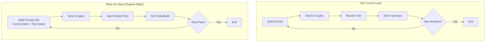

Based on my research into the original Ralph Wiggum Loop methodology and comparing it with your architecture document, I've identified several **critical misalignments** that explain why your tests may be failing:

---

## Critical Misalignments Between Your Architecture and the Original Ralph Approach

### 1. **Fresh Context Per Iteration vs. Accumulated History**

| Original Ralph                                                              | Your Implementation                                                             |
| --------------------------------------------------------------------------- | ------------------------------------------------------------------------------- |
| Each loop iteration starts a **fresh agent session** to avoid "context rot" | Your `Loop Engine` accumulates previous progress and history between iterations |
| `while :; do cat PROMPT.md \| claude ; done` — simple, stateless            | Maintains `previousProgress`, `history` across iterations                       |

**Impact:** Long-running context windows can cause the model to "drift" or become confused. The original Ralph intentionally discards conversation history and starts fresh each time.

**Fix:** Consider resetting the agent session (or at minimum, minimizing carried-over context) between iterations. Each iteration should primarily see the **current state of the filesystem and tests**, not a summary of what the AI previously said.

---

### 2. **Objective, Testable Exit Criteria vs. AI-Determined Completion**

| Original Ralph                                                                                                   | Your Implementation                                                    |
| ---------------------------------------------------------------------------------------------------------------- | ---------------------------------------------------------------------- |
| Loop exits only when **external, objective criteria** are met (tests pass, build succeeds, completion tag found) | You rely on `shouldContinue()` state machine checks and AI "summaries" |
| Stop hook intercepts and **verifies** before exiting                                                             | No evidence of automated test/build verification as a gate             |

**Impact:** Your architecture's "Current Limitations" section confirms this: *"No clear completion signal expected"*. The original Ralph **never trusts the AI to say "I'm done"**—it uses external verification (e.g., `npm test`, `make build`, or a completion promise tag in the output).

**Fix:** Add a **stop hook** that runs after each iteration:
```bash
# Pseudocode
if run_tests() == SUCCESS:
    exit_loop()
else:
    continue_loop_with_test_output()
```

---

### 3. **AI Must Act on the Filesystem vs. Just Describing Changes**

| Original Ralph                                                          | Your Implementation                                          |
| ----------------------------------------------------------------------- | ------------------------------------------------------------ |
| The AI agent **directly writes files** (Claude CLI, Copilot agent mode) | Your agent "receives text response" and "stores in memory"   |
| Changes are visible in git diff for next iteration                      | No file operations; AI describes changes but nothing happens |

**Impact:** Your architecture diagram under "The Fundamental Gap" explicitly shows this: *"AI describes changes but nothing happens"*. The core Ralph loop depends on the AI **actually modifying files** so that the next iteration can verify the changes.

**Fix:** This is your most critical gap. You need either:
- Use a Copilot mode that supports direct file writes (agentic mode)
- Implement your proposed **Response Parser** and **Action Executor** to parse structured output and apply changes

---

### 4. **Feedback Loop: AI Sees Results of Its Actions**

| Original Ralph                                                               | Your Implementation                                                                    |
| ---------------------------------------------------------------------------- | -------------------------------------------------------------------------------------- |
| Next iteration shows **current filesystem state, git diff, and test output** | Context includes history but not the results of actions (because no actions are taken) |
| AI learns from failures by seeing actual error messages                      | No feedback loop since no actions are executed                                         |

**Impact:** Even if you fix #3 above, you need to feed back the **actual results** (test output, build errors, git diff) to the AI in the next iteration.

**Fix:** Your "Feedback Builder" proposal is correct. The next prompt should include:
```
## Result of Previous Actions
- Created file.sh ✓
- Test output: FAIL
  Error: "addition function not found"
Continue working on task.
```

---

### 5. **Simple Prompt vs. Complex Prompt Template**

| Original Ralph                                          | Your Implementation                                                               |
| ------------------------------------------------------- | --------------------------------------------------------------------------------- |
| Prompt is minimal: task + context + completion criteria | Your prompt includes iteration counts, token tracking, detailed history summaries |
| Focus on **what to do** and **how to know when done**   | Includes meta-information that may confuse weaker models                          |

**Impact:** Your prompt template includes:
```
- Iteration: {iteration} of {max_iterations}
- Tokens used: {tokens_used} of {max_tokens}
```
This meta-information is **noise** for the AI. The original Ralph keeps prompts focused on the task and current state.

**Fix:** Simplify your prompt template. The AI doesn't need to know about token limits or iteration counts—your orchestrator manages that. The AI should only see:
1. The task
2. Current file state / git diff
3. Previous test/build output (if any)
4. Clear completion criteria

---

### 6. **Model-Agnostic vs. Model-Sensitive**

| Original Ralph                                            | Your Implementation                                                                       |
| --------------------------------------------------------- | ----------------------------------------------------------------------------------------- |
| Works with Claude, which has strong instruction-following | You note *"Weaker models perform poorly"* and *"Prompt relies on implicit understanding"* |

**Impact:** The original Ralph was designed for Claude's agentic mode which has excellent instruction-following. If you're using `gpt-4.1` or other models, you need more explicit output formats.

**Fix:** Your proposed structured action format is correct:
```
[ACTION:CREATE]
path: calculator.sh
```bash
content
```
```
This explicit format compensates for weaker instruction-following.

---

## Summary of Required Adjustments

| Priority       | Issue                      | Fix                                                                      | Status |
| -------------- | -------------------------- | ------------------------------------------------------------------------ | ------ |
| **🔴 Critical** | No file operations         | Implement Response Parser + Action Executor, or use agentic Copilot mode | ✅ FIXED |
| **🔴 Critical** | No objective exit criteria | Add stop hook that runs tests/build before allowing loop exit            | ✅ FIXED |
| **🔴 Critical** | No feedback loop           | Feed test output and git diff to next iteration                          | ✅ FIXED |
| **🟡 High**     | Context accumulation       | Reset or minimize context between iterations; rely on filesystem state   | ✅ FIXED |
| **🟡 High**     | Complex prompt template    | Simplify; remove meta-info like iteration/token counts                   | ✅ FIXED |
| **🟢 Medium**   | Model compensation         | Use explicit structured output format for weaker models                  | ✅ FIXED |

---

## ✅ Realignment Complete

All 6 issues have been addressed. The CLI now follows the core Ralph pattern:
1. **Actions are parsed and executed** (Response Parser + Action Executor)
2. **Objective exit criteria** (Verification Hooks run tests/build)
3. **Feedback loop** (Feedback Builder shows action/test results)
4. **Fresh context** (Skip previous progress, rely on git diff)
5. **Simple prompts** (No meta-info, just task + state + feedback)
6. **Model compensation** (Detailed examples for weaker models)

---

## Recommended Architecture Changes



Your architecture document already identifies these gaps in the "Current Limitations" and "Enhancement Opportunities" sections. The fix is to **implement those enhancements**—they are not optional, they are essential for the Ralph pattern to work.