# GitHub Copilot Ralph - Architecture & Integration Guide

This document explains the internal architecture of GitHub Copilot Ralph, focusing on how the CLI orchestrates autonomous coding loops using the GitHub Copilot SDK.

## Table of Contents

- [Overview](#overview)
- [High-Level Architecture](#high-level-architecture)
- [The Run Command Flow](#the-run-command-flow)
- [Copilot SDK Integration](#copilot-sdk-integration)
- [The Iteration Loop](#the-iteration-loop)
- [Current Limitations](#current-limitations)
- [Enhancement Opportunities](#enhancement-opportunities)

---

## Overview

GitHub Copilot Ralph is a CLI tool that implements the "Ralph Wiggum Loop" pattern - an autonomous coding loop where an AI agent iteratively works on tasks. The CLI acts as an **orchestrator** that:

1. Reads tasks from a plan (Markdown file or GitHub Issues)
2. Builds context-rich prompts
3. Sends prompts to GitHub Copilot via the SDK
4. Receives AI responses
5. Tracks progress and manages iterations

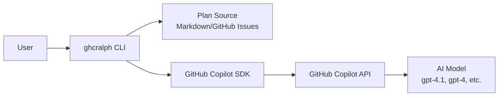

---

## High-Level Architecture

### Component Overview

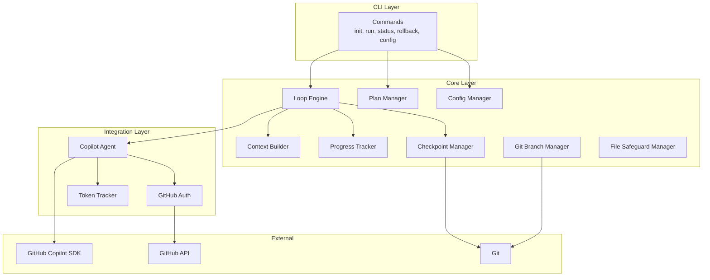

### Key Components

| Component              | File                                | Responsibility                   |
| ---------------------- | ----------------------------------- | -------------------------------- |
| **Loop Engine**        | `src/core/loop-engine.ts`           | Orchestrates the iteration loop  |
| **Context Builder**    | `src/core/context-builder.ts`       | Builds prompts with task context |
| **Copilot Agent**      | `src/integrations/copilot-agent.ts` | Interfaces with Copilot SDK      |
| **Plan Manager**       | `src/core/plan-manager.ts`          | Reads/updates task plans         |
| **Progress Tracker**   | `src/core/progress-tracker.ts`      | Tracks session progress          |
| **Checkpoint Manager** | `src/core/checkpoint-manager.ts`    | Creates git checkpoints          |

---

## The Run Command Flow

When you execute `ghcralph run`, here's the complete flow:

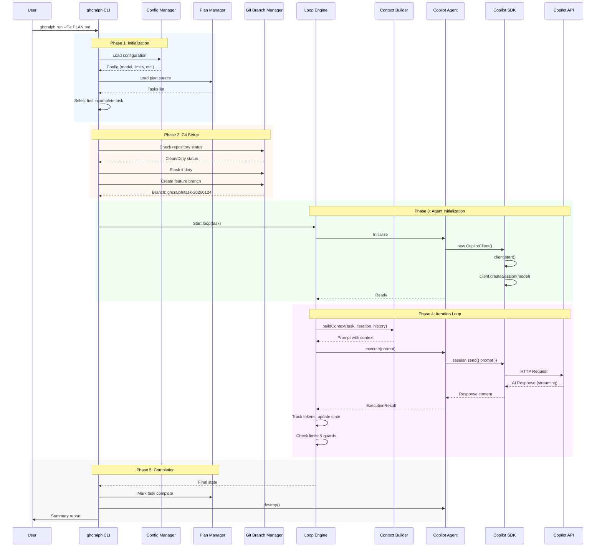

### Phase Details

#### Phase 1: Initialization
1. **Load Configuration**: Merges CLI flags → env vars → local config → global config → defaults
2. **Load Plan**: Parses Markdown checkboxes or fetches GitHub Issues
3. **Task Selection**: Finds first task with `[ ]` (unchecked)

#### Phase 2: Git Setup
1. **Status Check**: Ensures working directory is clean (or stashes changes)
2. **Branch Creation**: Creates isolated branch `ghcralph/{task-slug}-{date}`
3. **Baseline Capture**: Records existing files for deletion protection

#### Phase 3: Agent Initialization
1. **Authentication**: Tries `gh auth token` → `GITHUB_TOKEN` → `COPILOT_CLI_USAGE_TOKEN`
2. **SDK Setup**: Creates CopilotClient and CopilotSession with model selection
3. **Session Ready**: Agent reports initialized status

#### Phase 4: Iteration Loop
This is the core of the Ralph pattern - detailed in the next section.

#### Phase 5: Completion
1. **State Finalization**: Marks task as complete in plan file
2. **Cleanup**: Destroys Copilot session and client
3. **Report**: Shows summary (iterations, tokens, time, status)

---

## Copilot SDK Integration

### SDK Components

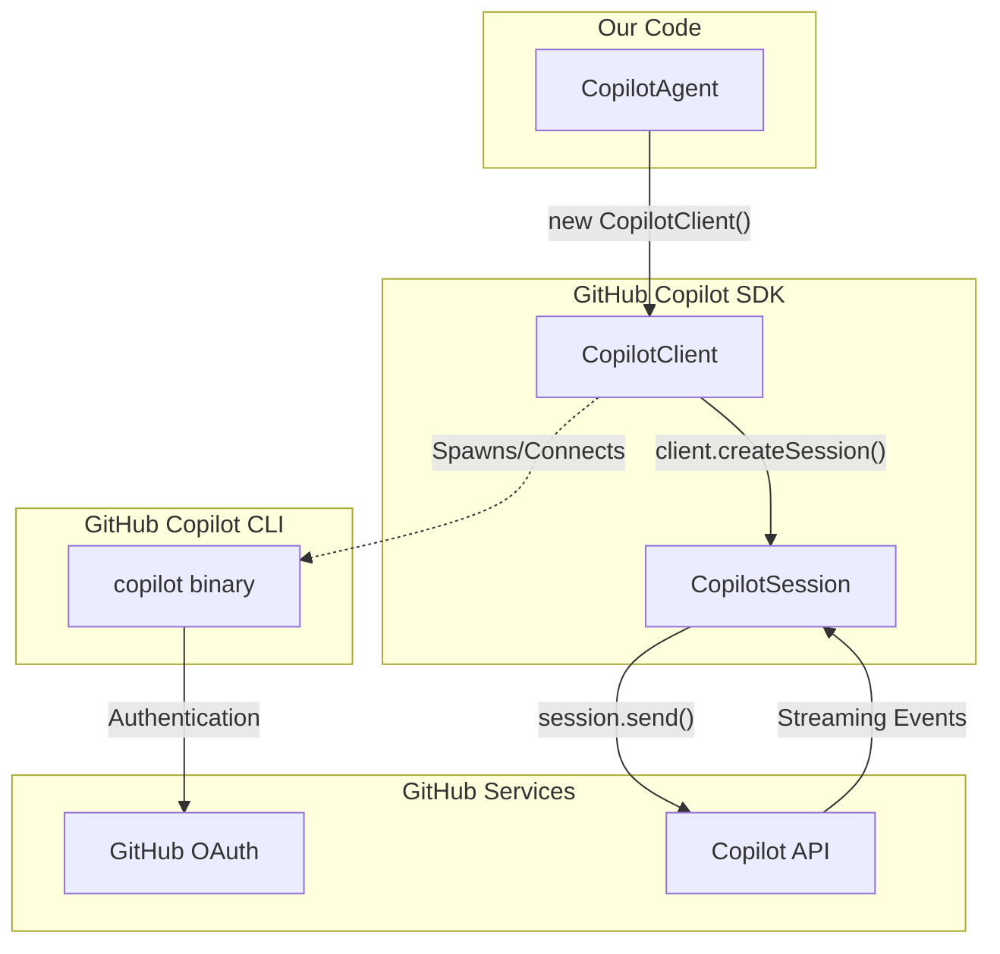

### Authentication Flow

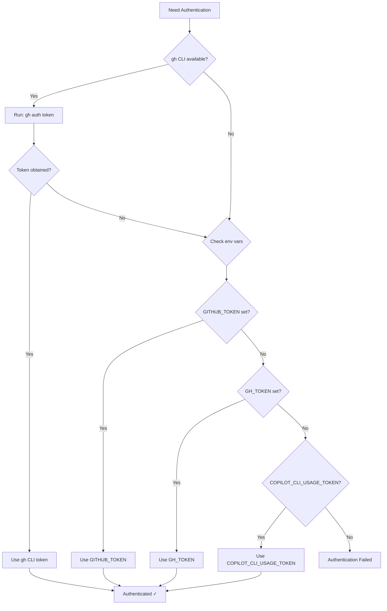

### SDK Event Handling

The Copilot SDK uses an event-driven model:

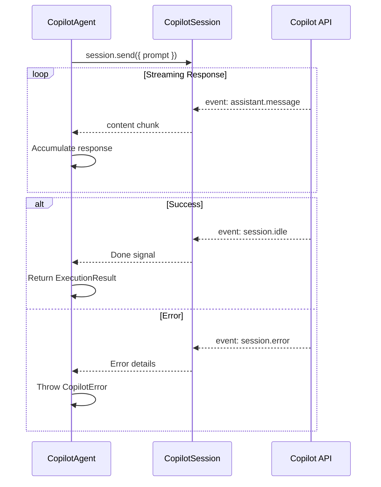

### Current SDK Usage Code

```typescript
// Initialize (copilot-agent.ts lines 92-130)
this.client = new CopilotClient({ autoStart: true, logLevel: 'info' });
await this.client.start();
this.session = await this.client.createSession({ model: this.config.model });

// Execute (copilot-agent.ts lines 184-235)
await this.session.send({ prompt });

// Event handling
this.session.on((event) => {
  if (event.type === 'assistant.message') {
    responseContent += event.data.content ?? '';
  } else if (event.type === 'session.idle') {
    // Done
  } else if (event.type === 'session.error') {
    // Handle error
  }
});
```

---

## The Iteration Loop

### Current Loop State Machine

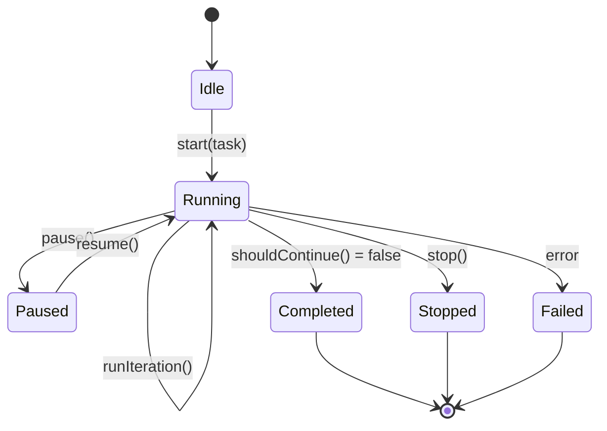

### Iteration Detail

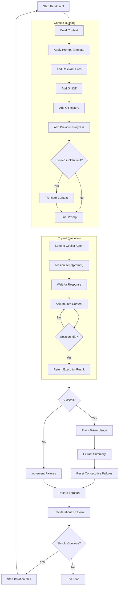

### Prompt Template (Current)

```
You are an expert software engineer. Your task is: {task_title}

## Task Description
{task_content}

## Current State
- Iteration: {iteration} of {max_iterations}
- Tokens used: {tokens_used} of {max_tokens}

## Context
### Relevant Files
{file contents...}

### Current Changes (git diff)
{diff output...}

### Recent Git History
{git log...}

### Project Structure
{file list...}

## Previous Progress
- Iteration 1: {summary}
- Iteration 2: {summary}

## Instructions
- Make small, focused changes
- Test your changes when possible
- Explain your reasoning
- Stop when the task is complete
```

---

## Current Limitations

### The Fundamental Gap

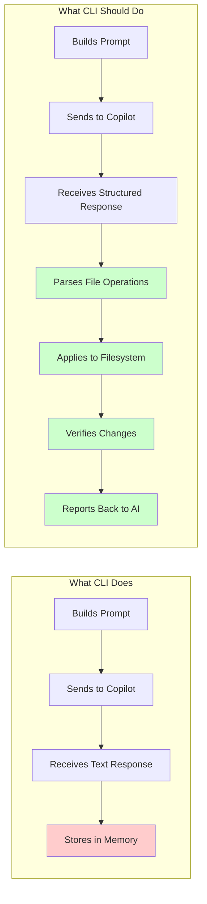

### Identified Issues

| Issue                          | Impact                                   | Root Cause                              | Status  |
| ------------------------------ | ---------------------------------------- | --------------------------------------- | ------- |
| **No file operations**         | AI describes changes but nothing happens | Response not parsed for file operations | ✅ FIXED |
| **No objective exit criteria** | AI declares done but tests may fail      | No external verification                | ✅ FIXED |
| **No feedback loop**           | AI can't verify its changes worked       | No mechanism to show execution results  | ✅ FIXED |
| **Context accumulation**       | Model drifts with long context           | Conversation history accumulates        | ✅ FIXED |
| **Complex prompt template**    | Meta-info confuses weaker models         | Iteration/token counts in prompt        | ✅ FIXED |
| **Model sensitivity**          | Weaker models perform poorly             | Prompt relies on implicit understanding | ✅ FIXED |
| **Single task per run**        | Only first task processed, then exits    | No outer loop for multi-task iteration  | ✅ FIXED v0.1.2 |
| **Hardcoded model list**       | Init shows outdated model options        | Model list not fetched from SDK         | ✅ FIXED v0.1.2 |
| **Progress file not persisting** | Task history lost between tasks        | No session-based accumulation           | ✅ FIXED v0.1.3 |
| **Git lock race conditions**   | Concurrent git ops fail with lock errors | No mutex protection for git operations  | ✅ FIXED v0.1.3 |
| **False completion claims**    | AI claims COMPLETE despite failures      | No honesty guidance in prompts          | ✅ FIXED v0.1.3 |
| **No auto-push to remote**     | Changes stay on local branch only        | No push implementation                  | ✅ FIXED v0.1.3 |
| **Confusing commit messages**  | Every task shows "iteration 1"           | No task X/Y context in messages         | ✅ FIXED v0.1.3 |
| **Insufficient progress detail** | Progress file lacks debugging info     | No configurable verbosity               | ✅ FIXED v0.1.3 |

### Current vs Expected Flow

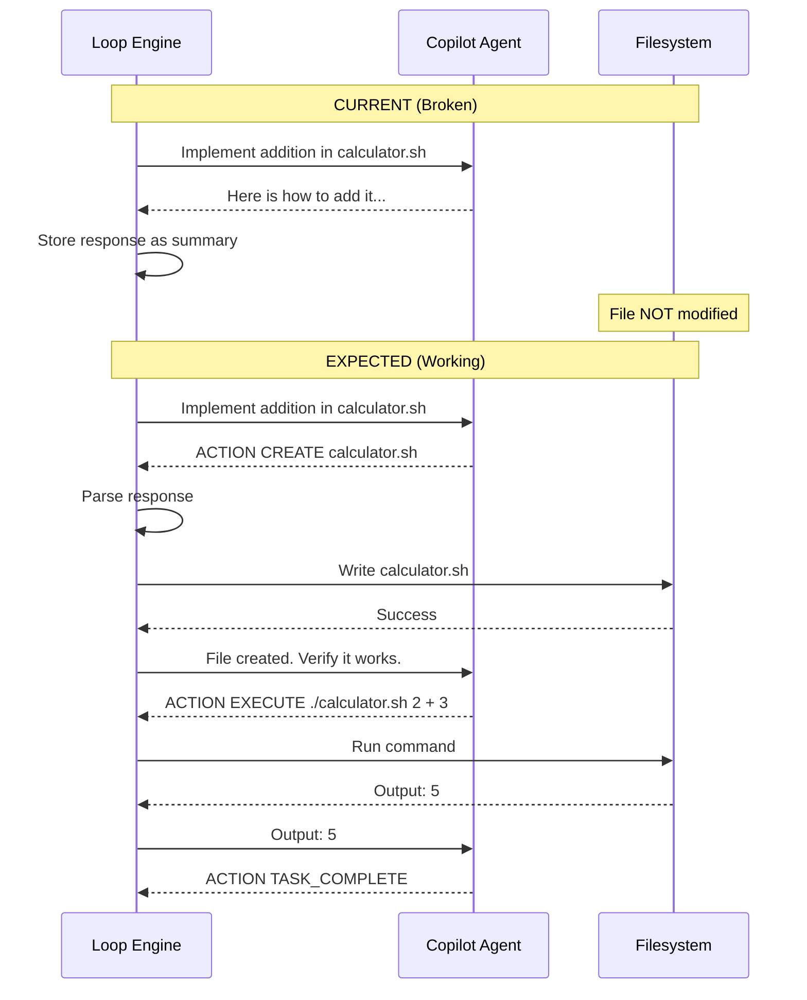

---

## Enhancement Opportunities

### 1. Structured Output Format

Define an explicit response format that even weaker models can follow:

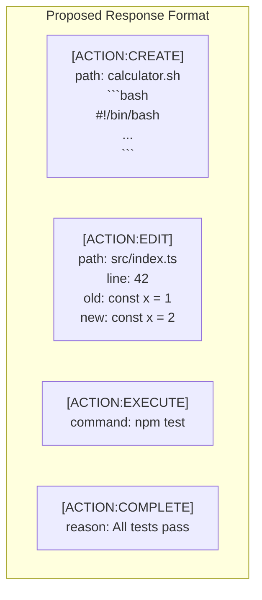

### 2. Response Parser ✅ IMPLEMENTED

The response parser component has been implemented in `src/core/response-parser.ts`:

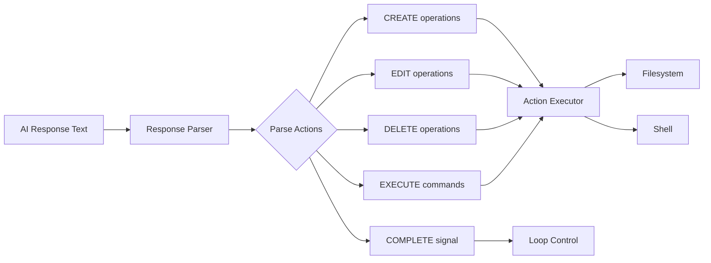

**Key Functions:**
- `parseResponse(text)`: Parses AI response and extracts all action blocks
- `hasCompleteAction(result)`: Checks if task is marked complete
- `getActionsByType(result, type)`: Filters actions by type

### 2.1 Action Executor ✅ IMPLEMENTED

The action executor component has been implemented in `src/core/action-executor.ts`:

**Supported Actions:**
| Action     | Description                | Example                                         |
| ---------- | -------------------------- | ----------------------------------------------- |
| `CREATE`   | Create a new file          | `[ACTION:CREATE] path: file.txt`                |
| `EDIT`     | Edit existing file         | `[ACTION:EDIT] path: file.txt [OLD]...[NEW]...` |
| `DELETE`   | Delete a file              | `[ACTION:DELETE] path: file.txt`                |
| `EXECUTE`  | Run shell command          | `[ACTION:EXECUTE] command: npm test`            |
| `COMPLETE` | Mark task done             | `[ACTION:COMPLETE] reason: Tests pass`          |
| `STUCK`    | Signal blocked/unable      | `[ACTION:STUCK] attempted:... blocker:...`      |

**Safety Features:**
- Path validation (prevents escaping working directory)
- File safeguard integration (protects baseline files from deletion)
- Command timeout (30 seconds default)
- Dry run mode for testing

### 2.1.1 STUCK Action ✅ NEW in v0.1.2

The STUCK action allows the AI agent to signal when it cannot complete a task:

```
[ACTION:STUCK]
attempted: What the agent tried to do
blocker: What is preventing completion
suggestion: Optional suggestion for next steps
```

**Behavior:**
- STUCK triggers a task retry with a fresh AI agent
- The progress file documents the failed attempt for context
- After `maxRetriesPerTask` (default: 2) STUCKs, the task is marked failed
- Prevents false completion claims - encourages honest failure reporting

### 2.2 Verification Hooks ✅ IMPLEMENTED

The verification hooks component has been implemented in `src/core/verification-hooks.ts`:

**Purpose**: Provide objective exit criteria (tests pass, build succeeds) rather than trusting the AI to say "I'm done".

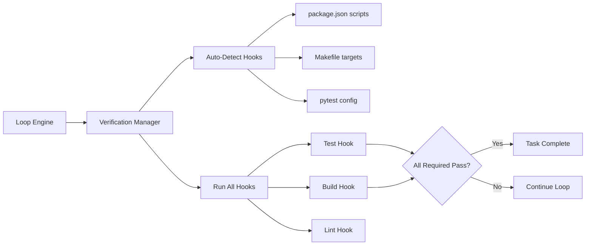

**Features:**
- Auto-detects verification hooks from project config (npm scripts, Makefile, pytest)
- Runs test, build, lint commands after each iteration
- Only required hooks block completion (lint is optional by default)
- Timeout protection for long-running commands
- Detailed result summaries with pass/fail status

**Example Detection:**
| File                                | Detected Hooks             |
| ----------------------------------- | -------------------------- |
| `package.json` with `scripts.test`  | `npm test` (required)      |
| `package.json` with `scripts.build` | `npm run build` (required) |
| `package.json` with `scripts.lint`  | `npm run lint` (optional)  |
| `Makefile` with `test:` target      | `make test` (required)     |
| `pytest.ini` or `pyproject.toml`    | `pytest` (required)        |

### 2.3 Feedback Builder ✅ IMPLEMENTED

The feedback builder component has been implemented in `src/core/feedback-builder.ts`:

**Purpose**: Build structured feedback from action execution and verification results to show the AI what actually happened, enabling it to iterate effectively.

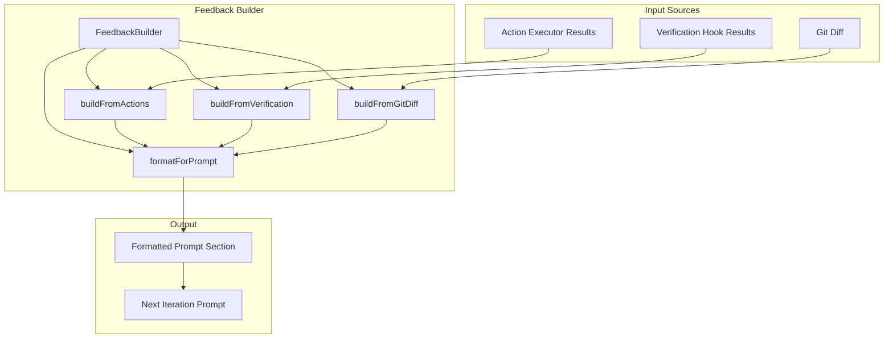

**Features:**
- Combines action results, verification output, and git diff
- Formats with success/failure indicators (✓/✗)
- Truncates long output to avoid context bloat
- Includes "Next Steps" guidance when failures occur
- Detects task completion (all actions + verification passed)

**Example Output:**
```markdown
## Feedback from Previous Iteration

### Action Results
✓ Created file: calculator.sh
✓ Made file executable

### Verification Results
✗ Tests failed (1500ms)
```
Expected output: 5
Received output: 0
```

### Next Steps
Review the failures above and continue working on the task.
```

### 2.4 Fresh Context per Iteration ✅ IMPLEMENTED

The context builder now supports the Ralph pattern's core principle: fresh context per iteration.

**Problem**: Accumulated conversation history causes "context rot" - the model drifts and gets confused by long context windows.

**Solution**: Modified `src/core/context-builder.ts` to:
- Default to `freshContextPerIteration: true` - previous iteration summaries are NOT included
- Default to `includeMetaInfo: false` - no iteration/token counts in prompt
- Rely on git diff as primary source of "what has been done"

**Configuration Options:**
| Option                     | Default | Description                          |
| -------------------------- | ------- | ------------------------------------ |
| `freshContextPerIteration` | `true`  | Skip previous iteration summaries    |
| `includeMetaInfo`          | `false` | Skip iteration/token counts          |
| `includeGitDiff`           | `true`  | Include current changes (essential!) |

**Prompt Template Changes:**

The default prompt template is now simplified and includes structured ACTION format:
```
You are an expert software engineer. Your task is: {task_title}

## Task Description
{task_content}

{context_section}
{feedback_section}

## Output Format
Use structured ACTION blocks to make changes:
[ACTION:CREATE] / [ACTION:EDIT] / [ACTION:EXECUTE] / [ACTION:COMPLETE]

## Instructions
- Make small, focused changes
- Test your changes with [ACTION:EXECUTE]
- Use [ACTION:COMPLETE] when tests pass and task is done
```

### 2.5 Model Compensation ✅ IMPLEMENTED

The prompt examples module (`src/core/prompt-examples.ts`) provides model-appropriate examples.

**Problem**: The original Ralph pattern was designed for Claude's strong instruction-following. Weaker models (like gpt-4.1, the default due to 0x cost) need more explicit examples.

**Solution**: Dynamic prompt examples based on model strength:

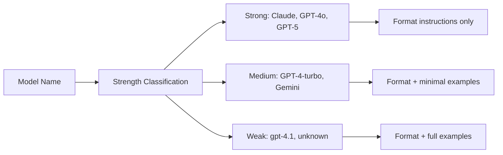

**Model Classification:**
| Model             | Strength | Example Content            |
| ----------------- | -------- | -------------------------- |
| Claude (any)      | Strong   | Format instructions only   |
| GPT-4o, GPT-5     | Strong   | Format instructions only   |
| GPT-4-turbo       | Medium   | Format + minimal examples  |
| Gemini            | Medium   | Format + minimal examples  |
| gpt-4.1 (default) | Weak     | Format + detailed examples |
| Unknown models    | Weak     | Format + detailed examples |

**Configuration:**
```typescript
const builder = new ContextBuilder({
  model: 'gpt-4.1', // Default - gets full examples
});
```

**Example Detail Levels:**

For **weak models**, full examples are included:
```
### Example: Create a new file
[ACTION:CREATE]
path: src/calculator.sh
\`\`\`bash
#!/bin/bash
num1=$1
op=$2
num2=$3
case $op in
    "+") echo $((num1 + num2)) ;;
    ...
esac
\`\`\`

### Example: Edit an existing file
[ACTION:EDIT]
path: src/calculator.sh
[OLD]
case $op in
    "+") echo $((num1 + num2)) ;;
esac
[NEW]
case $op in
    "+") echo $((num1 + num2)) ;;
    "-") echo $((num1 - num2)) ;;
esac
```

For **strong models**, only format instructions are included (they don't need examples).

**Tests Added**: 22 new tests for prompt examples

**Total Tests**: 267 passing

### 3. Enhanced Prompt Template

```
You are an autonomous coding agent. Your task is: {task_title}

## Task Description
{task_content}

## IMPORTANT: Response Format
You MUST respond using ONLY these action blocks:

### To create a file:
[ACTION:CREATE]
path: relative/path/to/file.ext
```
file content here
```

### To edit a file:
[ACTION:EDIT]
path: relative/path/to/file.ext
[OLD]
exact lines to replace
[NEW]
replacement lines

### To run a command:
[ACTION:EXECUTE]
command: your command here

### When task is complete:
[ACTION:COMPLETE]
reason: explanation of what was done

## Rules
1. Output ONLY action blocks - no explanations outside blocks
2. One action per block
3. Use CREATE for new files, EDIT for existing files
4. Always verify with EXECUTE before COMPLETE
5. If unsure, use EXECUTE to inspect current state

{context_section}
{previous_progress}
```

### 4. Feedback Loop Architecture

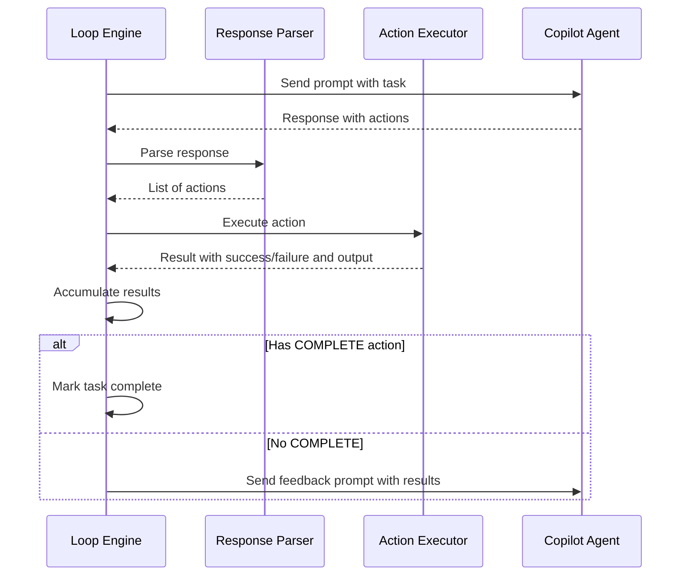

### 5. Model Compensation Strategies

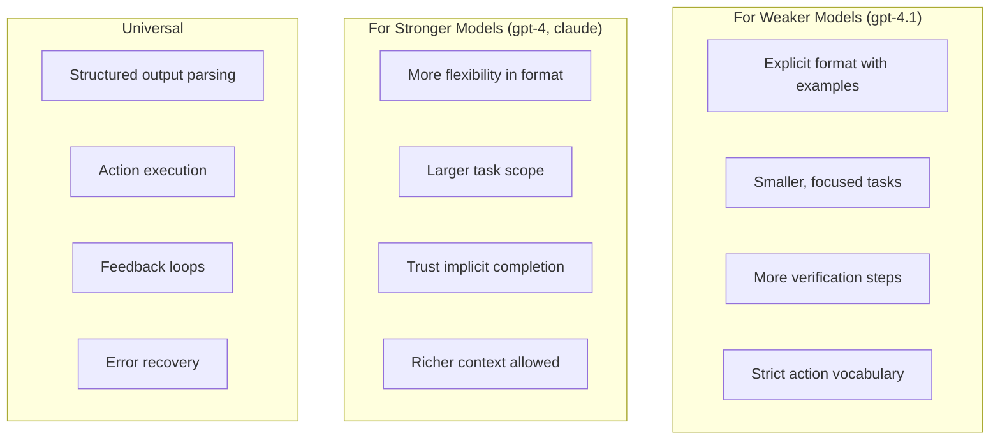

### 6. Proposed Component Architecture

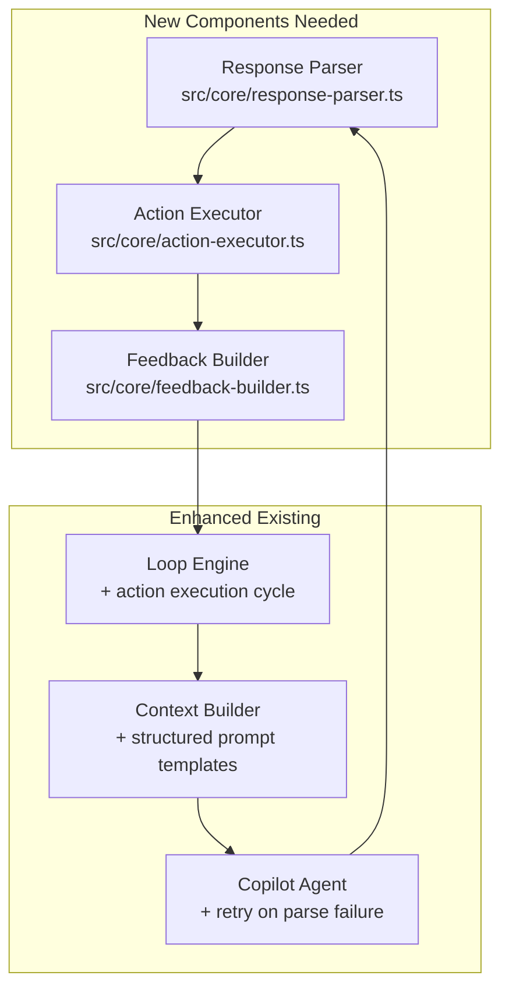

---

## Summary

The current architecture successfully:
- ✅ Authenticates with GitHub Copilot
- ✅ Manages iteration loops with limits and guards
- ✅ **Processes ALL tasks in plan files** (multi-task loop)
- ✅ Creates **fresh AI agent per task** (Ralph pattern core)
- ✅ Builds context-rich prompts
- ✅ Sends/receives from Copilot SDK
- ✅ Tracks progress and tokens
- ✅ Parses structured ACTION responses
- ✅ Executes file and shell actions
- ✅ Supports graceful failure with STUCK action
- ✅ Dynamic model discovery from SDK
- ✅ **Session-based progress persistence** (v0.1.3)
- ✅ **Mutex-protected git operations** (v0.1.3)
- ✅ **Configurable push strategy** (v0.1.3)
- ✅ **Configurable progress verbosity** (v0.1.3)
- ✅ **Task X/Y numbered commits** (v0.1.3)

The CLI has evolved from a "chat wrapper" to a true "agent executor" that:
1. Defines explicit action formats (CREATE, EDIT, DELETE, EXECUTE, COMPLETE, STUCK)
2. Parses AI responses for structured actions
3. Executes actions on the filesystem
4. Provides feedback to inform subsequent iterations
5. Processes multiple tasks with task-level retries and checkpoints
6. Persists full task history across multi-task runs (v0.1.3)
7. Prevents git race conditions with mutex protection (v0.1.3)

---

## v0.1.3 Enhancements

### Session-Based Progress Tracking

The progress tracker now maintains full history across multi-task runs:

```typescript
// src/core/progress-tracker.ts
interface RunSession {
  startTime: Date;
  branch?: string;
  totalTasks?: number;
  completedTasks: TaskResult[];  // Full history of all completed tasks
  currentTask?: {
    taskId: string;
    taskTitle: string;
    taskNumber: number;
    state: FullLoopState;
  };
}
```

**Key Methods:**
- `startSession(branch?, totalTasks?)` - Initialize session tracking
- `setCurrentTask(task, taskNumber)` - Update current task context
- `recordTaskCompletion(result)` - Archive completed task with all iterations
- `generateFullSessionMarkdown()` - Output complete history to progress.md

### Git Mutex Protection

All git operations are now serialized via `async-mutex` to prevent race conditions:

```typescript
// src/core/checkpoint-manager.ts
import { Mutex } from 'async-mutex';

class CheckpointManager {
  private gitMutex = new Mutex();

  async createCheckpoint(iteration, summary, tokens, taskContext?) {
    return this.gitMutex.runExclusive(async () => {
      // All git operations protected
    });
  }
}
```

**Protected Operations:**
- `createCheckpoint()` - Iteration commits
- `createTaskCheckpoint()` - Task completion commits
- `createFailureCheckpoint()` - Failure documentation
- `rollbackTo()`, `hardRollbackTo()`, `rollbackAll()` - Rollback operations

### Configurable Push Strategy

New `pushStrategy` configuration option:

| Strategy | Behavior | Use Case |
|----------|----------|----------|
| `per-task` (default) | Push after each task completes | Continuous backup |
| `per-run` | Push once at end of run | Batch operations |
| `manual` | Never auto-push | Full local control |

```json
{
  "autoPush": true,
  "pushStrategy": "per-task"
}
```

### Progress Verbosity Configuration

New `progressVerbosity` configuration option:

| Level | Content | Use Case |
|-------|---------|----------|
| `minimal` | Just iteration header | CI environments |
| `standard` (default) | Tokens, summary, duration | Normal use |
| `full` | Standard + raw response + actions | Debugging |

```json
{
  "progressVerbosity": "full"
}
```

### Task-Numbered Commit Messages

Commits now include task position context:

```
# Iteration commits
ghcralph: task 3/11 iter 1 - Created calculator script
ghcralph: task 3/11 iter 2 - Fixed syntax error

# Task completion commits  
ghcralph: task 3/11 complete - Calculator basic operations
```

**Implementation:**
```typescript
interface TaskContext {
  taskNumber: number;   // 1-indexed position
  totalTasks: number;   // Total in plan
}

// Used by createCheckpoint() and createTaskCheckpoint()
```

### Honesty Guidance

Enhanced prompt engineering to prevent false completion claims:

```typescript
// src/core/context-builder.ts - HONESTY_GUIDANCE section
const HONESTY_GUIDANCE = `
## Completion Integrity
Never use [ACTION:COMPLETE] if:
- Commands failed with non-zero exit codes
- Syntax errors or runtime errors exist
- You're unsure if the task is fully done

If blocked, use [ACTION:STUCK] with:
- attempted: What you tried
- blocker: What's preventing completion
- suggestion: Possible next steps
`;
```

**Failure Warning:**
The ActionExecutor now warns when COMPLETE is used despite failed commands:

```typescript
// src/core/action-executor.ts
if (action.type === 'COMPLETE' && this.hasFailedCommands()) {
  warn(`⚠️ Task marked complete despite ${failures.length} command failures`);
}

```

---

## v0.1.4 Enhancements

### Commit Message Quality

v0.1.4 introduces structured `[COMMIT_MESSAGE]` blocks for better commit message quality:

**Prompt Addition:**
```typescript
// src/core/prompt-examples.ts
export const COMMIT_MESSAGE_EXAMPLE = `[COMMIT_MESSAGE]
Add division operation with error handling
[/COMMIT_MESSAGE]`;
```

**Extraction Priority Chain:**
```typescript
// src/core/loop-engine.ts - extractSummary()
// 1. Explicit [COMMIT_MESSAGE] block (preferred)
// 2. [ACTION:COMPLETE] reason (for completions)
// 3. First action type with context (e.g., "Create src/utils.ts")
// 4. First non-preamble line (fallback)
```

**Word-Boundary Truncation:**
```typescript
// Avoids mid-word cuts like "implementati..."
function truncateAtWord(str: string, maxLen: number): string {
  if (str.length <= maxLen) return str;
  const targetLen = maxLen - 3;  // Room for "..."
  const truncated = str.substring(0, targetLen);
  const lastSpace = truncated.lastIndexOf(' ');
  if (lastSpace > targetLen * 0.5) {
    return truncated.substring(0, lastSpace) + '...';
  }
  return truncated + '...';
}
```

### Session-Based Progress Tracking

v0.1.4 fixes progress file persistence to retain all task history:

**Architecture:**
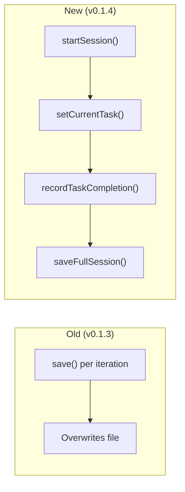

**Methods Used:**
- `startSession(branch, totalTasks)` - Initialize session tracking
- `setCurrentTask(taskNumber, state)` - Update in-memory state per iteration
- `recordTaskCompletion(state, status, ...)` - Add task to history and persist

### Push Reminder Message

v0.1.4 shows a helpful message when auto-push is disabled:

```
💡 Changes committed locally. Review and push manually with: git push
   To enable auto-push, set "autoPush": true in .ghcralph/config.json
```

### Standard Verbosity Actions

v0.1.4 includes executed actions in `standard` verbosity (previously `full` only):

```markdown
#### Iteration 1 (4:40:05 PM) ✓

- **Tokens**: 1,325
- **Summary**: Create calculator.sh
- **Duration**: 20s

**Actions**:
- ✓ `[CREATE]` calculator.sh
- ✓ `[EXECUTE]` chmod +x calculator.sh
```
