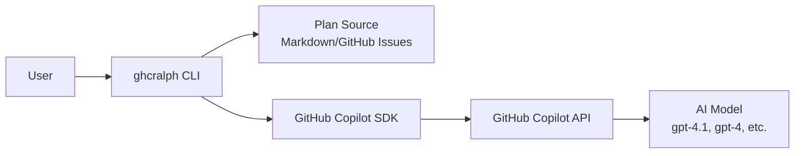
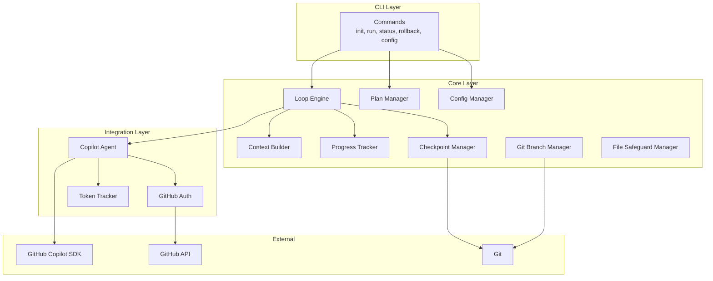
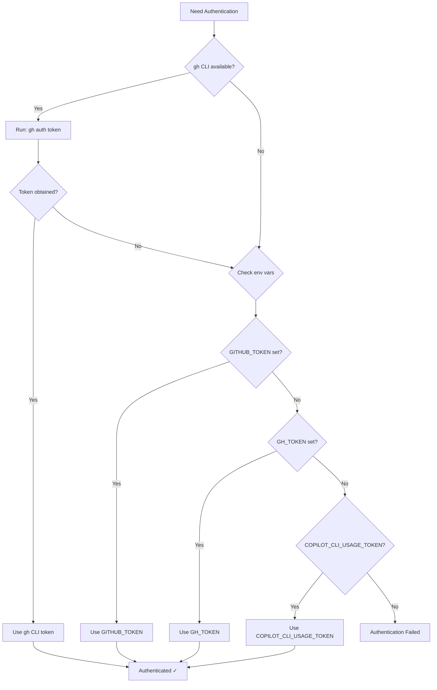
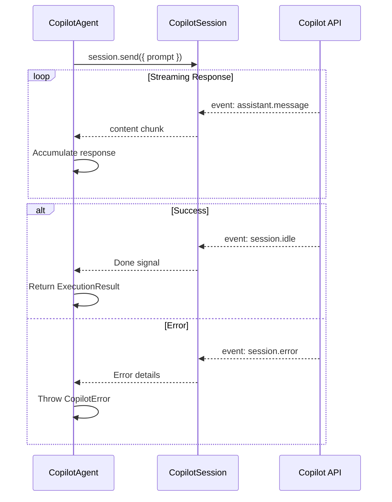
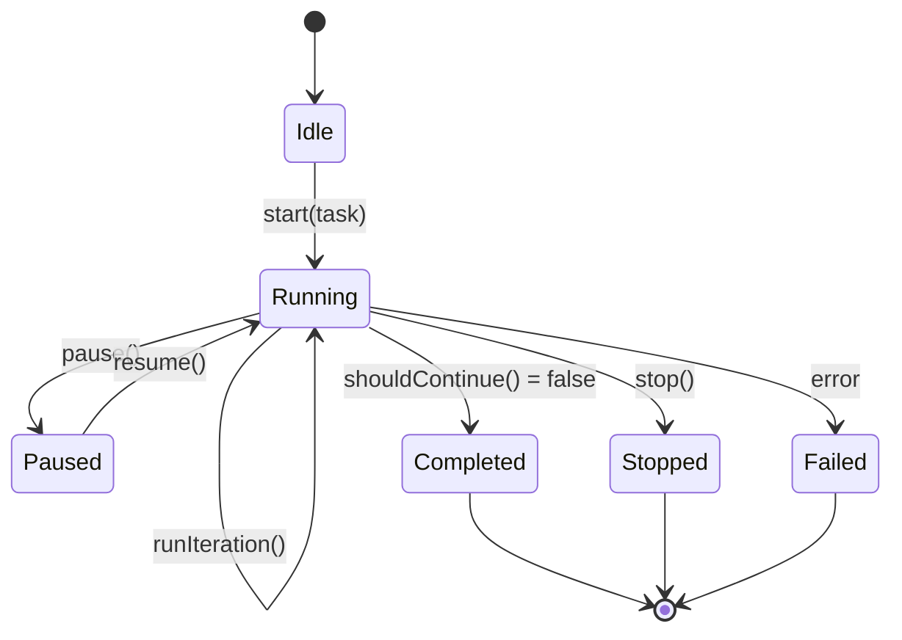
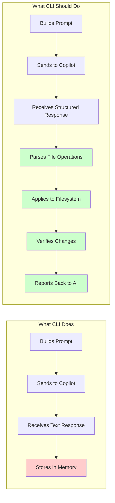
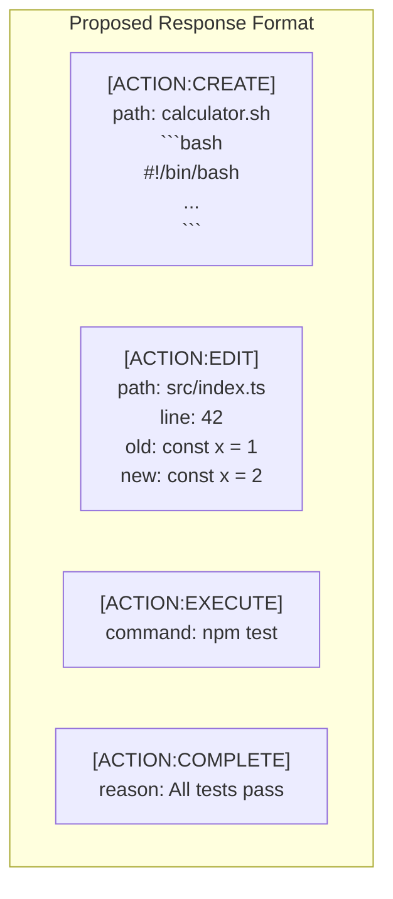
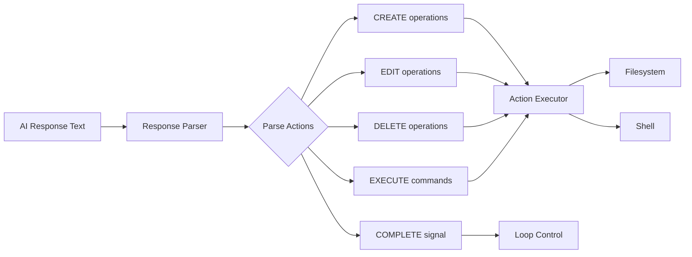
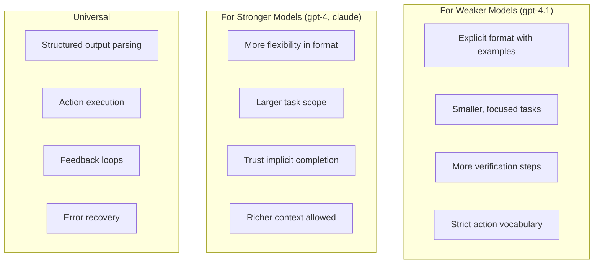
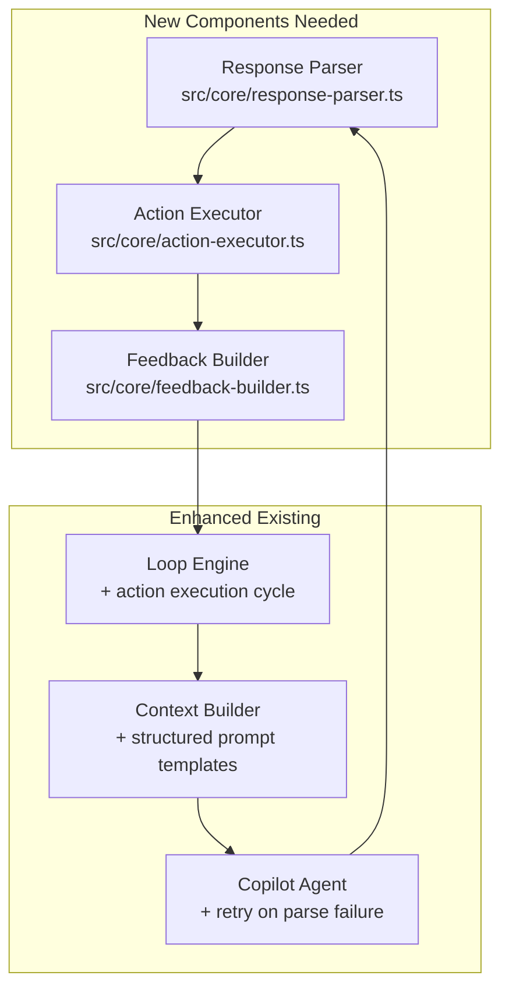

# GitHub Copilot Ralph - Architecture & Integration Guide

This document explains the internal architecture of GitHub Copilot Ralph, focusing on how the CLI orchestrates autonomous coding loops using the GitHub Copilot SDK.

## Table of Contents

- [Overview](#overview)
- [High-Level Architecture](#high-level-architecture)
- [The Run Command Flow](#the-run-command-flow)
- [Copilot SDK Integration](#copilot-sdk-integration)
- [The Iteration Loop](#the-iteration-loop)
- [Current Limitations](#current-limitations)
- [Enhancement Opportunities](#enhancement-opportunities)

---

## Overview

GitHub Copilot Ralph is a CLI tool that implements the "Ralph Wiggum Loop" pattern - an autonomous coding loop where an AI agent iteratively works on tasks. The CLI acts as an **orchestrator** that:

1. Reads tasks from a plan (Markdown file or GitHub Issues)
2. Builds context-rich prompts
3. Sends prompts to GitHub Copilot via the SDK
4. Receives AI responses
5. Tracks progress and manages iterations



---

## High-Level Architecture

### Component Overview



### Key Components

| Component | File | Responsibility |
|-----------|------|----------------|
| **Loop Engine** | `src/core/loop-engine.ts` | Orchestrates the iteration loop |
| **Context Builder** | `src/core/context-builder.ts` | Builds prompts with task context |
| **Copilot Agent** | `src/integrations/copilot-agent.ts` | Interfaces with Copilot SDK |
| **Plan Manager** | `src/core/plan-manager.ts` | Reads/updates task plans |
| **Progress Tracker** | `src/core/progress-tracker.ts` | Tracks session progress |
| **Checkpoint Manager** | `src/core/checkpoint-manager.ts` | Creates git checkpoints |

---

## The Run Command Flow

When you execute `ghcralph run`, here's the complete flow:

```mermaid
sequenceDiagram
    participant User
    participant CLI as ghcralph CLI
    participant Config as Config Manager
    participant Plan as Plan Manager
    participant Git as Git Branch Manager
    participant Loop as Loop Engine
    participant Context as Context Builder
    participant Agent as Copilot Agent
    participant SDK as Copilot SDK
    participant API as Copilot API

    User->>CLI: ghcralph run --plan PLAN.md
    
    rect rgb(240, 248, 255)
        Note over CLI,Config: Phase 1: Initialization
        CLI->>Config: Load configuration
        Config-->>CLI: Config (model, limits, etc.)
        CLI->>Plan: Load plan source
        Plan-->>CLI: Tasks list
        CLI->>CLI: Select first incomplete task
    end
    
    rect rgb(255, 248, 240)
        Note over CLI,Git: Phase 2: Git Setup
        CLI->>Git: Check repository status
        Git-->>CLI: Clean/Dirty status
        CLI->>Git: Stash if dirty
        CLI->>Git: Create feature branch
        Git-->>CLI: Branch: ghcralph/task-20260124
    end
    
    rect rgb(240, 255, 240)
        Note over Loop,API: Phase 3: Agent Initialization
        CLI->>Loop: Start loop(task)
        Loop->>Agent: Initialize
        Agent->>SDK: new CopilotClient()
        SDK->>SDK: client.start()
        SDK->>SDK: client.createSession(model)
        Agent-->>Loop: Ready
    end
    
    rect rgb(255, 240, 255)
        Note over Loop,API: Phase 4: Iteration Loop
        loop Each Iteration (1 to maxIterations)
            Loop->>Context: buildContext(task, iteration, history)
            Context-->>Loop: Prompt with context
            Loop->>Agent: execute(prompt)
            Agent->>SDK: session.send({ prompt })
            SDK->>API: HTTP Request
            API-->>SDK: AI Response (streaming)
            SDK-->>Agent: Response content
            Agent-->>Loop: ExecutionResult
            Loop->>Loop: Track tokens, update state
            Loop->>Loop: Check limits & guards
        end
    end
    
    rect rgb(248, 248, 248)
        Note over CLI,Plan: Phase 5: Completion
        Loop-->>CLI: Final state
        CLI->>Plan: Mark task complete
        CLI->>Agent: destroy()
        CLI->>User: Summary report
    end
```

### Phase Details

#### Phase 1: Initialization
1. **Load Configuration**: Merges CLI flags → env vars → local config → global config → defaults
2. **Load Plan**: Parses Markdown checkboxes or fetches GitHub Issues
3. **Task Selection**: Finds first task with `[ ]` (unchecked)

#### Phase 2: Git Setup
1. **Status Check**: Ensures working directory is clean (or stashes changes)
2. **Branch Creation**: Creates isolated branch `ghcralph/{task-slug}-{date}`
3. **Baseline Capture**: Records existing files for deletion protection

#### Phase 3: Agent Initialization
1. **Authentication**: Tries `gh auth token` → `GITHUB_TOKEN` → `COPILOT_CLI_USAGE_TOKEN`
2. **SDK Setup**: Creates CopilotClient and CopilotSession with model selection
3. **Session Ready**: Agent reports initialized status

#### Phase 4: Iteration Loop
This is the core of the Ralph pattern - detailed in the next section.

#### Phase 5: Completion
1. **State Finalization**: Marks task as complete in plan file
2. **Cleanup**: Destroys Copilot session and client
3. **Report**: Shows summary (iterations, tokens, time, status)

---

## Copilot SDK Integration

### SDK Components

```mermaid
graph TB
    subgraph "Our Code"
        CA[CopilotAgent]
    end
    
    subgraph "GitHub Copilot SDK (@github/copilot-sdk)"
        CC[CopilotClient]
        CS[CopilotSession]
    end
    
    subgraph "GitHub Copilot CLI"
        CLI_BIN[/usr/local/bin/copilot]
    end
    
    subgraph "GitHub Services"
        AUTH[GitHub OAuth]
        API[Copilot API]
    end
    
    CA -->|"new CopilotClient()"| CC
    CC -->|"client.createSession()"| CS
    CC -.->|"Spawns/Connects"| CLI_BIN
    CLI_BIN -->|"Authentication"| AUTH
    CS -->|"session.send()"| API
    API -->|"Streaming Events"| CS
```

### Authentication Flow



### SDK Event Handling

The Copilot SDK uses an event-driven model:



### Current SDK Usage Code

```typescript
// Initialize (copilot-agent.ts lines 92-130)
this.client = new CopilotClient({ autoStart: true, logLevel: 'info' });
await this.client.start();
this.session = await this.client.createSession({ model: this.config.model });

// Execute (copilot-agent.ts lines 184-235)
await this.session.send({ prompt });

// Event handling
this.session.on((event) => {
  if (event.type === 'assistant.message') {
    responseContent += event.data.content ?? '';
  } else if (event.type === 'session.idle') {
    // Done
  } else if (event.type === 'session.error') {
    // Handle error
  }
});
```

---

## The Iteration Loop

### Current Loop State Machine



### Iteration Detail

```mermaid
flowchart TB
    Start[Start Iteration N] --> BuildContext
    
    subgraph "Context Building"
        BuildContext[Build Context] --> Template[Apply Prompt Template]
        Template --> AddFiles[Add Relevant Files]
        AddFiles --> AddDiff[Add Git Diff]
        AddDiff --> AddHistory[Add Git History]
        AddHistory --> AddPrevious[Add Previous Progress]
        AddPrevious --> CheckSize{Exceeds token limit?}
        CheckSize -->|Yes| Truncate[Truncate Context]
        CheckSize -->|No| FinalPrompt
        Truncate --> FinalPrompt[Final Prompt]
    end
    
    FinalPrompt --> SendToCopilot[Send to Copilot Agent]
    
    subgraph "Copilot Execution"
        SendToCopilot --> SDKSend[session.send(prompt)]
        SDKSend --> WaitResponse[Wait for Response]
        WaitResponse --> AccumulateContent[Accumulate Content]
        AccumulateContent --> SessionIdle{Session Idle?}
        SessionIdle -->|No| AccumulateContent
        SessionIdle -->|Yes| ReturnResult[Return ExecutionResult]
    end
    
    ReturnResult --> ProcessResult{Success?}
    
    ProcessResult -->|Yes| TrackTokens[Track Token Usage]
    TrackTokens --> ExtractSummary[Extract Summary]
    ExtractSummary --> ResetFailures[Reset Consecutive Failures]
    
    ProcessResult -->|No| IncrementFailures[Increment Failures]
    
    ResetFailures --> RecordIteration[Record Iteration]
    IncrementFailures --> RecordIteration
    
    RecordIteration --> EmitEvent[Emit iterationEnd Event]
    EmitEvent --> CheckContinue{Should Continue?}
    
    CheckContinue -->|Yes| NextIteration[Start Iteration N+1]
    CheckContinue -->|No| EndLoop[End Loop]
    
    NextIteration --> Start
```

### Prompt Template (Current)

```
You are an expert software engineer. Your task is: {task_title}

## Task Description
{task_content}

## Current State
- Iteration: {iteration} of {max_iterations}
- Tokens used: {tokens_used} of {max_tokens}

## Context
### Relevant Files
{file contents...}

### Current Changes (git diff)
{diff output...}

### Recent Git History
{git log...}

### Project Structure
{file list...}

## Previous Progress
- Iteration 1: {summary}
- Iteration 2: {summary}

## Instructions
- Make small, focused changes
- Test your changes when possible
- Explain your reasoning
- Stop when the task is complete
```

---

## Current Limitations

### The Fundamental Gap



### Identified Issues

| Issue | Impact | Root Cause | Status |
|-------|--------|------------|--------|
| **No file operations** | AI describes changes but nothing happens | Response not parsed for file operations | ✅ FIXED |
| **No structured output** | AI returns free-form text | Prompt doesn't specify output format | 🔄 In Progress |
| **Task verification loop** | AI keeps verifying same task | No clear completion signal expected | 🔄 In Progress |
| **Model sensitivity** | Weaker models perform poorly | Prompt relies on implicit understanding | 🔄 In Progress |
| **No feedback loop** | AI can't verify its changes worked | No mechanism to show execution results | ⏳ Pending |

### Current vs Expected Flow

```mermaid
sequenceDiagram
    participant Loop as Loop Engine
    participant Agent as Copilot Agent
    participant FS as Filesystem

    Note over Loop,FS: CURRENT (Broken)
    Loop->>Agent: "Implement addition in calculator.sh"
    Agent-->>Loop: "Here's how to add it:<br/>```bash<br/>echo $((num1 + num2))<br/>```"
    Loop->>Loop: Store response as summary
    Note over FS: File NOT modified ❌

    Note over Loop,FS: EXPECTED (Working)
    Loop->>Agent: "Implement addition in calculator.sh"
    Agent-->>Loop: [STRUCTURED] CREATE calculator.sh:<br/>content...
    Loop->>Loop: Parse response
    Loop->>FS: Write calculator.sh
    FS-->>Loop: Success
    Loop->>Agent: "File created. Verify it works."
    Agent-->>Loop: [STRUCTURED] EXECUTE: ./calculator.sh 2 + 3
    Loop->>FS: Run command
    FS-->>Loop: Output: 5
    Loop->>Agent: "Output: 5"
    Agent-->>Loop: [STRUCTURED] TASK_COMPLETE
```

---

## Enhancement Opportunities

### 1. Structured Output Format

Define an explicit response format that even weaker models can follow:



### 2. Response Parser ✅ IMPLEMENTED

The response parser component has been implemented in `src/core/response-parser.ts`:



**Key Functions:**
- `parseResponse(text)`: Parses AI response and extracts all action blocks
- `hasCompleteAction(result)`: Checks if task is marked complete
- `getActionsByType(result, type)`: Filters actions by type

### 2.1 Action Executor ✅ IMPLEMENTED

The action executor component has been implemented in `src/core/action-executor.ts`:

**Supported Actions:**
| Action | Description | Example |
|--------|-------------|---------|
| `CREATE` | Create a new file | `[ACTION:CREATE] path: file.txt` |
| `EDIT` | Edit existing file | `[ACTION:EDIT] path: file.txt [OLD]...[NEW]...` |
| `DELETE` | Delete a file | `[ACTION:DELETE] path: file.txt` |
| `EXECUTE` | Run shell command | `[ACTION:EXECUTE] command: npm test` |
| `COMPLETE` | Mark task done | `[ACTION:COMPLETE] reason: Tests pass` |

**Safety Features:**
- Path validation (prevents escaping working directory)
- File safeguard integration (protects baseline files from deletion)
- Command timeout (30 seconds default)
- Dry run mode for testing

### 3. Enhanced Prompt Template

```
You are an autonomous coding agent. Your task is: {task_title}

## Task Description
{task_content}

## IMPORTANT: Response Format
You MUST respond using ONLY these action blocks:

### To create a file:
[ACTION:CREATE]
path: relative/path/to/file.ext
```
file content here
```

### To edit a file:
[ACTION:EDIT]
path: relative/path/to/file.ext
[OLD]
exact lines to replace
[NEW]
replacement lines

### To run a command:
[ACTION:EXECUTE]
command: your command here

### When task is complete:
[ACTION:COMPLETE]
reason: explanation of what was done

## Rules
1. Output ONLY action blocks - no explanations outside blocks
2. One action per block
3. Use CREATE for new files, EDIT for existing files
4. Always verify with EXECUTE before COMPLETE
5. If unsure, use EXECUTE to inspect current state

{context_section}
{previous_progress}
```

### 4. Feedback Loop Architecture

```mermaid
sequenceDiagram
    participant Loop as Loop Engine
    participant Parser as Response Parser
    participant Exec as Action Executor
    participant Agent as Copilot Agent

    Loop->>Agent: Send prompt with task
    Agent-->>Loop: Response with actions
    
    Loop->>Parser: Parse response
    Parser-->>Loop: List of actions
    
    loop For each action
        Loop->>Exec: Execute action
        Exec-->>Loop: Result (success/failure, output)
        Loop->>Loop: Accumulate results
    end
    
    alt Has COMPLETE action
        Loop->>Loop: Mark task complete
    else No COMPLETE
        Loop->>Agent: Send feedback prompt
        Note over Loop,Agent: "Actions executed:<br/>- Created file.sh ✓<br/>- Test output: FAIL<br/>Continue working on task."
    end
```

### 5. Model Compensation Strategies



### 6. Proposed Component Architecture



---

## Summary

The current architecture successfully:
- ✅ Authenticates with GitHub Copilot
- ✅ Manages iteration loops with limits and guards
- ✅ Builds context-rich prompts
- ✅ Sends/receives from Copilot SDK
- ✅ Tracks progress and tokens

The current architecture lacks:
- ❌ Structured output format specification
- ❌ Response parsing for file operations
- ❌ Action execution (file create/edit/delete)
- ❌ Command execution for verification
- ❌ Feedback loop to inform AI of results
- ❌ Clear task completion detection

To work reliably with models like gpt-4.1, the CLI needs to move from a "chat wrapper" to a true "agent executor" that defines explicit action formats, parses responses, executes actions, and provides feedback.
